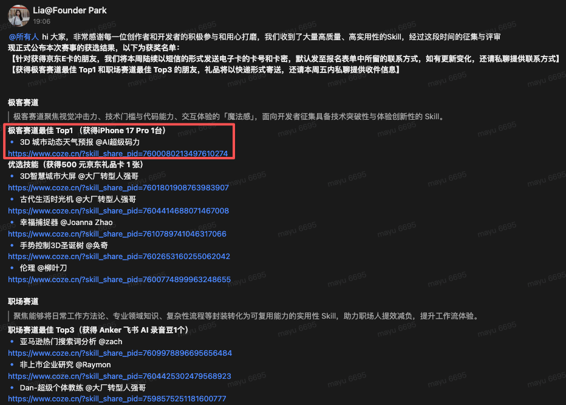

# 3D Weather Skill / SkyVibe AI

  <strong>AI 天气视觉工具</strong>

  输入城市名，30 秒内生成具有城市地标/人文特色的 3D 天气海报与 Live Photo 动态效果

  <strong>开放合作 / Open to opportunities</strong>

  欢迎 AI 产品合作、招聘机会、智能座舱方案交流

  

  
  
  
  

---

## 项目简介

3D Weather Skill / SkyVibe AI 是一个基于多模态大模型能力打造的 AI 天气视觉工具。

它不同于传统天气 App 的信息式展示，而是将“实时天气 + 城市地标/人文特色 + 3D 微缩景观 + 动态效果”组合成一套更具审美、传播性和情绪价值的天气表达方式。

用户只需要输入一个城市名，即可在 30 秒内得到：
- 一张 3D 城市天气海报
- 一段基于海报生成的 Live Photo 动态效果
- 中文化的信息展示与地点文案

---

## 获奖信息

本项目为扣子技能大赛获奖作品，获得：
- 极客赛道第一名🏆

  
  <!--  -->

---

## 为什么它不只是天气工具

传统天气产品大多强调“信息效率”，而这个项目更关注“信息如何被重新设计成有情绪、有风格、可传播的视觉内容”。

换句话说，它不只是在回答：
> 今天几度？是晴是阴？

它还在回答：
> 如果把一座城市今天的天气，变成一张具有在地特色的 3D 微缩城市海报，会是什么样？

这也是我对 AI 原生产品的一种理解：
- AI 不只是提高效率
- AI 也可以重塑表达形式
- AI 可以把常规信息重新变成内容、体验和传播素材

---

## 核心能力

- 实时天气信息获取：温度、天气状态等
- 城市特色提取：地标建筑、自然景观、人文元素
- 3D 微缩天气海报生成：统一风格、适合展示与分享
- Live Photo 动态效果生成：基于海报延展出 5 秒动态体验
- 中文化视觉输出：城市名、天气、温度等信息统一中文呈现
- 全球主要城市支持：面向全球主要城市输入场景

---

## 效果演示

### 海报示例

  
  
  

### 动态效果

  <!--  -->
    
    
    

>
> [观看高清视频演示](https://www.xiaohongshu.com/discovery/item/6984a059000000000a029327?app_platform=android&ignoreEngage=true&app_version=9.21.0&share_from_user_hidden=true&xsec_source=app_share&type=video&xsec_token=CBuZhis81Ew9HU4Y0z7q2aFVlxa6DD94PWck3lDSCIy1M%3D&author_share=1&xhsshare=&shareRedId=ODs5MjhHNUI2NzUyOTgwNjlHOTlFOjZO&apptime=1773324553&share_id=eed7018e2eff4fa59ac7b04874626844&share_channel=copy_link)

> [案例一：重庆天气查询](https://www.coze.cn/s/f42R7J791A8/)

> [案例二：台湾省台北市天气查询](https://www.coze.cn/s/BwL6zjPMsdM/)

> [案例三：上海、伊犁、西安天气查询](https://www.coze.cn/s/T2YGtVyxVNA/)

---
## 获奖背书

本项目获得 Founder Park × 字节 Skill Hackthon 极客赛道 TOP 1 🏆

这不仅是一个“效果不错的 AI demo”，也是一个已经在真实比赛场景中被验证过、获得外部认可的产品实验，它验证了：即便是天气这样一个成熟且高频的品类，在 AI 时代依然值得被重新做一遍。

  

更多公开背书见：[`docs/recognition.md`](docs/recognition.md)

## 为什么值得看

这个项目值得看的地方，不只是它生成的 3D 天气海报和 Live Photo 动态效果，而是它背后所代表的一种 AI 产品思路。

- 它不是在传统天气 App 上叠加一个 AI 功能，而是在尝试重做天气这类高频产品的体验方式。
- 我想重做的不是天气信息本身，而是天气体验：让用户更快获得感知、更强的结果感和更有情绪价值的输出。
- 这个项目也让我越来越确认一个判断：AI 产品正在从“功能型产品”走向“结果型产品”，未来的重点不只是页面和入口，而是任务理解、能力调用和结果交付。
- 天气只是一个高频入口。基于同样的能力框架，它还可以进一步延展到智能座舱、城市文旅、品牌联名等更大的产品场景。

## 不止于天气

我要做的，不是又一个孤立的天气工具。

准确地说，它是一个“把高频信息服务转化为情境化视觉体验”的 AI 能力样本。天气只是起点，后续我会继续围绕智能座舱、城市信息可视化、文旅表达和品牌化内容形态做更多延展。

相关文档：
- 产品愿景[`docs/product-vision.md`](docs/product-vision.md)
- 一页摘要&快速浏览[`docs/automotive-one-pager.md`](docs/automotive-one-pager.md)
- 完整产品思路&应用场景扩展[`docs/automotive-solution-ideas.md`](docs/automotive-solution-ideas.md)
- 获奖说明[`docs/recognition.md`](docs/recognition.md)

---
## 如何体验

### Coze 技能链接

- 在线体验：<https://www.coze.cn/?skill_share_pid=7600080213497610274>

### 输入示例

- 上海天气
- 伊犁天气
- 伦敦天气海报
- 台湾省台北市天气

### 输出逻辑

- 当用户明确表达“只要图片 / 天气海报 / 不要视频”时，输出静态海报
- 其他默认情况，输出海报 + Live Photo 动态效果

---

## 开源范围

这个仓库采用的是“展示性开源”策略。

本仓库公开：
- 项目介绍与设计思路
- 效果图与演示素材
- 用户使用说明
- 公开版 Prompt 框架
- 智能座舱方向的产品思考

本仓库不公开：
- 完整系统 Prompt
- `.skill` 导出文件
- `.coze` 配置文件
- 可直接复刻核心工作流的私有细节

详见：
- [`docs/open-source-scope.md`](docs/open-source-scope.md)
- [`docs/prompt-framework-public.md`](docs/prompt-framework-public.md)

---

## 智能座舱延展

这个项目虽然起点是一个天气技能，但我更感兴趣的是它在智能座舱中的延展潜力。

我过去长期在车联网与智能座舱领域做产品，因此我会把这个能力进一步思考为：
- 更有氛围感的天气可视化
- 更有在地感的导航目的地展示
- 更具惊喜感和传播性的车内 AI 体验
- 可与语音、地图、壁纸、HUD、后排屏联动的场景化能力

详见：
- 一页摘要&快速浏览[`docs/automotive-one-pager.md`](docs/automotive-one-pager.md)
- 完整产品思路&应用场景扩展[`docs/automotive-solution-ideas.md`](docs/automotive-solution-ideas.md)

---

## 关于我

我是一名拥有 15 年互联网产品经验的产品经理，目前正在做 AI 创业，也持续探索 AI 在工具、内容和行业场景中的产品化机会。

我长期关注的方向包括：
- AI 原生产品
- 多模态能力落地
- Web 工具开发
- 车联网与智能座舱体验
- AI 产品商业化与内容表达

这个仓库既是一个获奖项目的公开展示，也是我的一份作品集。

---

## 合作与联系

欢迎以下方向交流：
- AI 产品合作
- 招聘机会
- 顾问咨询
- 智能座舱 / 车机体验方案讨论
- 内容合作与媒体交流

联系方式：
- 邮箱 1：mayuzone.com@163.com
- 邮箱 2：mayuzone.com@gmail.com

> 后续我会建立交流群，并把群二维码更新到这里。

---

## 支持项目

如果这个项目对你有启发，欢迎：
- Star 本仓库
- 分享给更多朋友
- 关注我的内容账号
- 请我喝杯咖啡

  

---

